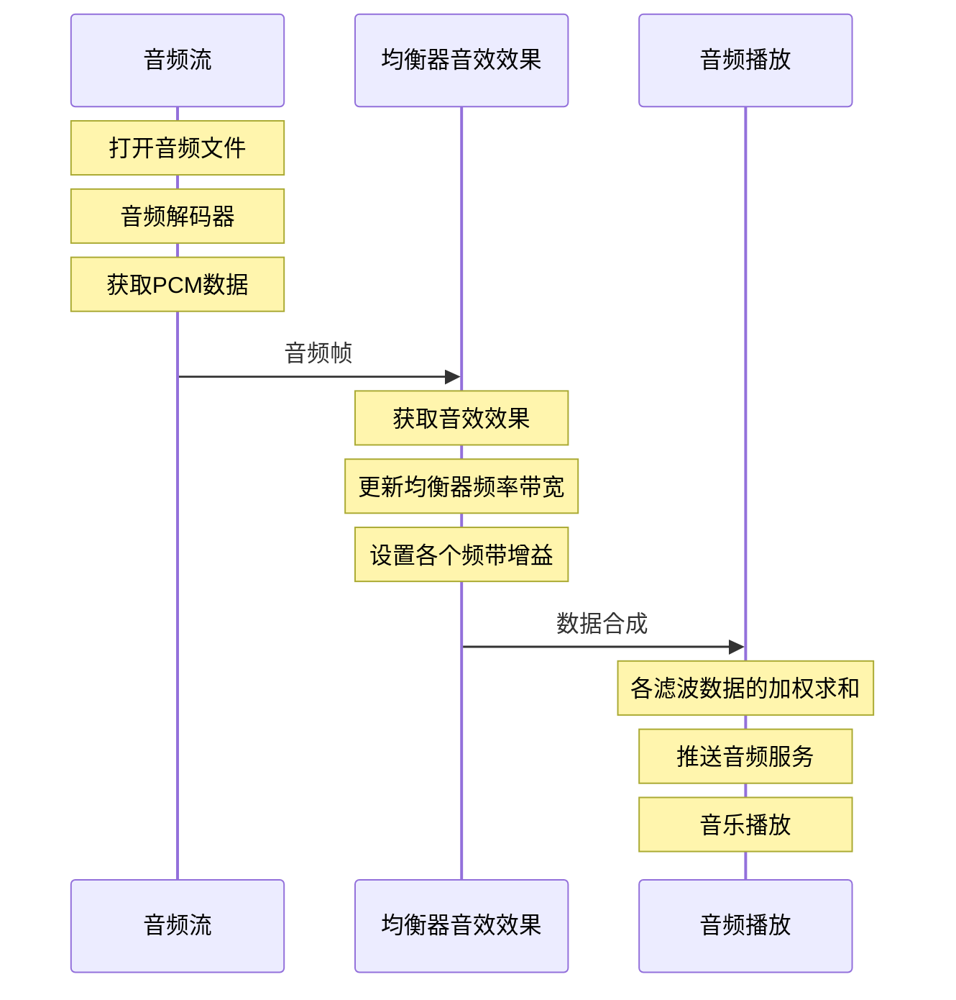
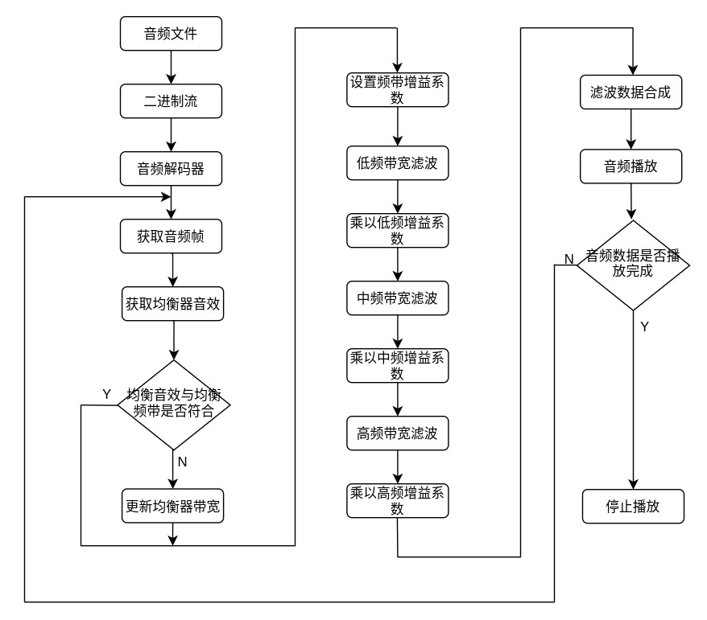
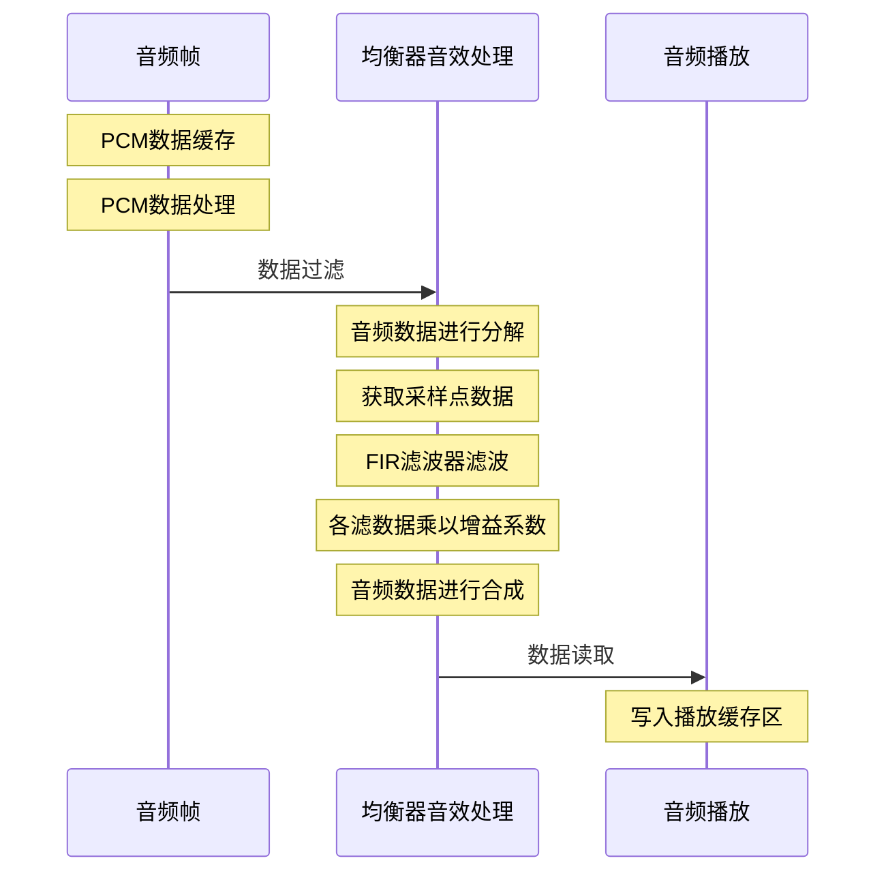
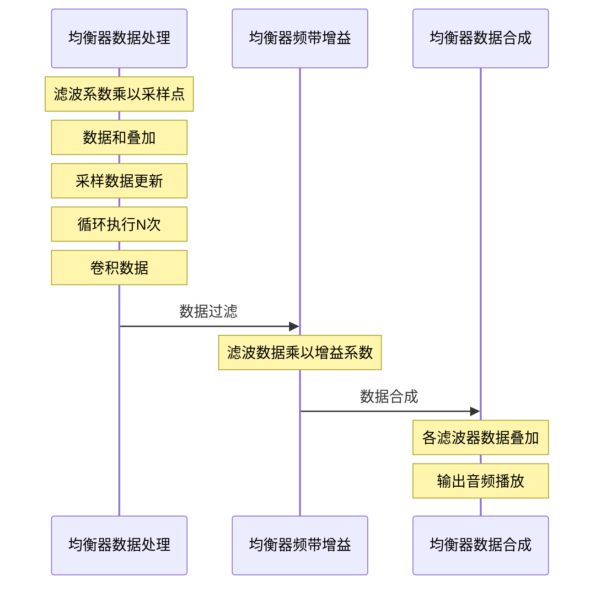
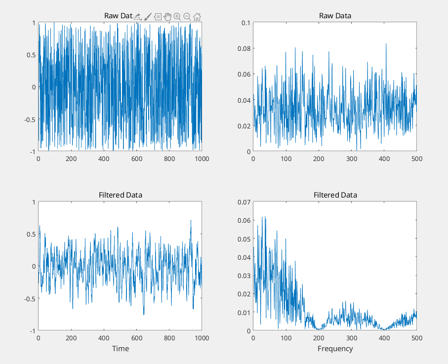
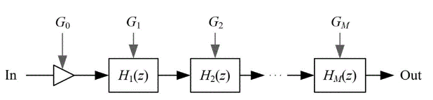
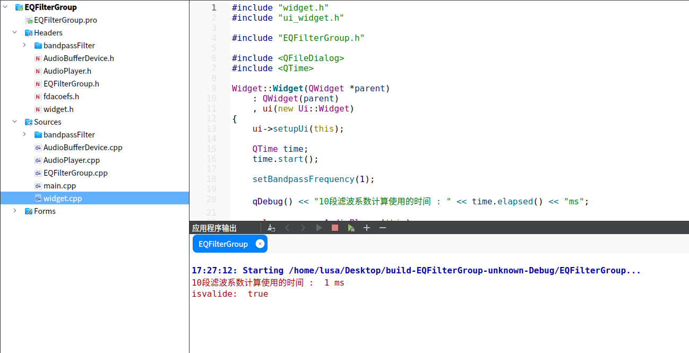
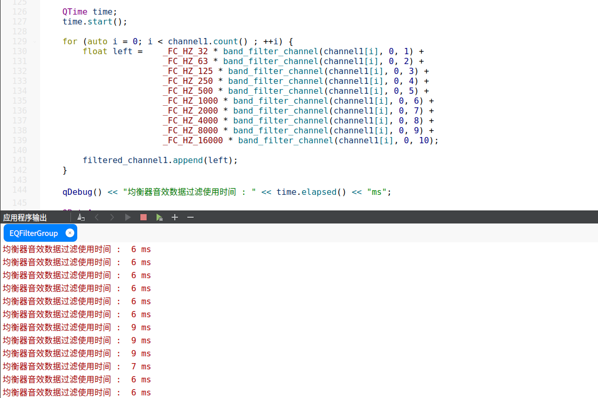
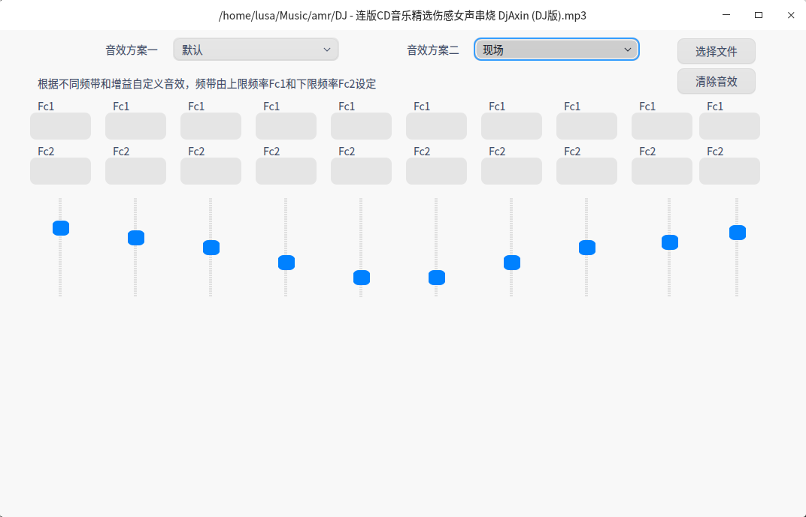

<h1 style="text-align:center">数字音频均衡器设计技术调研报告 </h1>

## 相关术语

| 缩写  |           全称            |                     描述                     |
| :---: | :-----------------------: | :------------------------------------------: |
| `PCM` |  `Pulse Code Modulation`  |       脉冲编码调制，数字通信的编码方式       |
| `FIR` | `Finite Impulse Response` |           有限长单位冲激响应滤波器           |
| `FFT` | `Fast Fourier transform`  |    快速傅立叶变换，时域至频域变换方法之一    |
| `FS`  |   `Frequency Sampling`    | 每秒从连续信号中提取并组成离散信号的采样个数 |

## 问题

​		均衡器是一种按照一定的规律，把人耳可听的频率`20Hz～20000Hz`划分为若干的频段，每个频段用户可以进行增益调节。可以根据需要，对输入的音频信号按照特定的频段进行单独的增益或衰减，实现各种音效效果。市场上常见的数字音频均衡器缺点是频率带宽都是固定不变，能实现的音效效果相对较少。为了用户可以体验更多的音效效果，本方案设计了一种的数字音频均衡器的频带是可变的，可以实现更多的音效效果。

## 现状

​		现有方案一，是10个中心频点为:`31Hz，63Hz，125Hz， 250Hz， 500Hz， 1000Hz， 2000Hz， 4000Hz， 8000Hz， 16000Hz`,按一倍频程公式计算各个频段的边界频率，然后设计各频段的滤波器，最后级联增益调节器再并接起来就构成了10段均衡器。

​		倍频程是指`20Hz`到`20000Hz`的声频范围分为几个频带，频带的上限频率比下限频率高一倍，即频率之比为2，这样划分的每一个频程称1倍频程，简称倍频程。如果在一个倍频程的上、下限频率之间再插入两个频率，使 4个频率之间的比值相同。这样将一个倍频程划分为3个频程，称这种频程为1/3倍频程。30段均衡器就是1/3倍频程均衡器。两个频率相比为2的声音间的频程，一倍频程之间为八度的音高关系，即频率每增加一倍，音高增加一个倍频程。频程的上限频率为`fu`，下限频率为`f1`，中心频率值为`f0`，则上下限频率之差值为*△f*，亦称为频带宽度。

​		现有方案二，是10个中心频点为:`60HZ`, `170Hz`,` 310Hz`,  `600Hz`, `1KHz`, `3KHz`,` 6KHz`, `12KHz`,`14KHz`, `16KHz`,依据频率的音感特征设计各滤波器频段，最后级联增益调节器再并接起来就构成了10段均衡器。

​		频率的音感特征有如下几种，`30~60Hz` 频段影响声音的音色空间感；`60~100Hz `频段影响声音的混厚感，是低音的基音区；`100~200Hz` 频段影响声音的厚实感，有底气；`200-500Hz` 频段影响声音的厚度和力度，好则人声明亮、清晰，否则单薄、混浊；`500-1KHz` 频段影响声音的明朗度；`1K-2KHz` 频段影响声音的明亮度，过多会使声音发硬；`2K-4Kz` 频段影响声音的亮度影响很大，对音乐的层次影响较大；`4K-8KzHz` 频段影响声音的清晰度、明亮度、如果这频率成分缺少，音色则变得平平淡淡;如果这段频率成分过多，音色则变得尖锐；`8k-12kHz` 频段影响声音的高音区，对音响的高频表现感觉最为敏感；`12k-16kHz` 频段影响声音的整体色彩感，这段过于黯淡会导致乐器失去个性，过多则会产生毛刺感；`16k-20kHz` 频段影响声音的高频的亮度，以及整体的空间感。


## 技术方案

​		本方案设计一种的数字音频均衡器的频带是可变的，均衡器可以生成更多的音效效果。根据不同的音效效果，自动调节均衡器的频率带宽和增益，如图3所示。均衡器使用FIR滤波器进行各频段数据过滤，由上限截止频率和下限截止频率生成频率带宽。



<center>图-3 技术方案</center>

### 整体设计  		

​		本方案的数字音频均衡器，使用2种默认频率带宽，分别是倍频程频率带宽和频率的音感特征频率带宽。可调频率带宽的均衡器，能实现更多的均衡器音效效果 。也可以按照其他的规律，设计频率带宽，来扩展均衡器音效效果。均衡器是由10个FIR带通滤波器并联而成的滤波器组构成。这些构成均衡器的滤波器带宽都是根据不同的音效效果进行设置的。用户通过选择均衡音效效果改变整体频响。数字音频均衡器实现流程，如图4所示。



<center>图-4 均衡器整体设计</center>

#### 		均衡器工作原理

​	　音频解码的`PCM `数据，是一个一个采样点顺序存放的方式存储，转换时只要逐个对采样数据进行转换即可。离散傅里叶变换需要对原始的连续信号进行离散化，原始信号离散化的过程其实就是以一定的采样周期对原始信号进行采样的过程。脉冲编码调制技术对音频信号的处理方式，连续的声音信号（模拟信号），通过采样，变成一个一个采样数据（数字信号）。如果采样周期是 `44100Hz`，则一秒钟的的声音会变成 44100 个采样数据。均衡器音效实现流程，如图5所示。



<center>图-5 均衡器音效处理</center>

#### 均衡器频带数据

​		傅里叶变换是指任何连续周期信号可以由一组适当的正弦曲线组合而成，这个转换就称为傅里叶转换。离散时间傅里叶变换在时域是离散的，但是在频域是连续的，而离散傅里叶变换则在时域和频域都以离散的形式呈现，因此，离散傅里叶变换更适用于所有使用计算机处理数据的场合。均衡器频带数据，是使用一段窗口函数与原信号中等大的一部分进行卷积。时域上的乘积等于频域上的卷积，使用窗口函数来处理源信号，卷积完这第一部分后时间后移一位，继续卷积，并把结果累加到输出信号中。均衡器频带数据处理，如图6所示



<center>图-6 滤波器数据过滤</center>

### 关键技术

#### FIR数字滤波原理

​		本方案数字音频均衡器是由10个FIR带通滤波器并联而成的滤波器组构成。滑动平均滤波器是每一次新的数据进来都在窗口进行一次平局然后输出。滑动平均滤波器也是FIR滤波器的一种，如图７所示。


<center>图-７ 3点滑动平均滤波器</center>

​		在这个滤波器中，可以看到每次把前三个数据进行平均(分别乘以0.33333)然后输出。 这三个系数的不同组合(0.3333, 0.333, 0.3333)就组成了各种FIR滤波器。这些系数叫做滤波系数。 在`matlab`中，他们叫做 b，滤波系数。下面是一个滑动平均滤波器的例子，使用plot函数绘制图形显示，如图８所示。

```matlab
npts=1000;
b=[.2 .2 .2 .2 .2]; % create filter coefficients for 5- point moving average

x=(rand(npts,1)*2)-1; % raw data from -1 to +1
filtered_data=filter(b,1,x); % filter using 'b' coefficients

subplot(2,2,1); % 1st subplot
plot(x); % plot raw data
title('Raw Data');
subplot(2,2,3); % 2nd subplot
plot(filtered_data); %plot filtered data
title('Filtered Data');
xlabel('Time')

% Perform FFT on original and filtered signal
fftpts=npts; % number points in FFT
hpts=fftpts/2; % half number of FFT points
x_fft=abs(fft(x))/hpts; %scaled FFT of original signal
filtered_fft=abs(fft(filtered_data))/hpts; %scaled FFT of filtered signal

subplot(2,2,2) %1st subplot
plot(x_fft(1:hpts)); %plot first half of data points
title('Raw Data');
subplot(2,2,4) %2nd subplot
plot(filtered_fft(1:hpts));%plot first half data points
title('Filtered Data');
xlabel('Frequency');
```

​	左边是原始数据和过滤数据,在时域的对比，右边是原始数据和过滤数据，在频域的对比。



<center>图-８ FIR低通滤波器</center>

​	滑动平均滤波器 一开始滤波的时候没有之前的数据做平均， filter函数是这样计算的

<center>filtered_data(2) = x(1)*0.2 + x(2)*0.2</center>

​	整体的5点滑动滤波的计算公式是：

<center>filtered_data(n) = b(1)*x(n) + b(2)*x(n-1) + b(3)*x(n-2) + b(4)*x(n-3) + b(5)*x(n-4)</center>


​	如果滤波器的阶数太大(N) 那么滤波后的数据要比原始信号"迟缓" 很多，这叫做相位延时。上图可以看出，5点滑动平均滤波器会使高频分量衰减。这是一种低通滤波器, 通低频，阻高频。FIR滤波器基本结构，如图９所示。


<center>图-９ FIR滤波器基本结构</center>

#### 代码实现FIR滤波器

 `MATLAB`的`FIR1`功能,设计的FIR带通滤波器的系数, 根据上限频率和下限频率设计的FIR带通滤波器代码如下

```matlab
function y = bandpassFilter(a, b)
%BANDPASS Returns a discrete-time filter object.

% MATLAB Code
% Generated by MATLAB(R) 9.7 and DSP System Toolbox 9.9.
% Generated on: 15-Mar-2021 21:03:40

% FIR Window Bandpass filter designed using the FIR1 function.

% All frequency values are in Hz.
Fs = 44100;  % 采样频率

N    = 99;    % 滤波阶数
Fc1  = a;     % 上限频率
Fc2  = b;     % 下限频率
flag = 'scale';  % 采样标志
% Create the window vector for the design algorithm.
win = hamming(N+1);  % 海明窗

% Calculate the coefficients using the FIR1 function.
y  = fir1(N, [Fc1 Fc2]/(Fs/2), 'bandpass', win, flag);
end
```

 借助`MATLAB® Coder™` 从` MATLAB` 代码生成 C++ 代码,如下

```matlab
void EQFilterGroup::filterCoefficient(double Fc01, double Fc02, double b[])
{
    /*-------计算滤波器系数---------*/

    double dv[2] = {0};
    dv[0] = Fc01 / (44100 / 2);
    dv[1] = Fc02 / (44100 / 2);

    // "bandpass";
    char b_cv[8] = {'b', 'a', 'n', 'd', 'p', 'a', 's', 's'};

    double dv1[100] = {
        0.0800, 0.0809, 0.0837, 0.0883, 0.0947, 0.1030, 0.1130, 0.1247, 0.1380, 0.1530,
        0.1696, 0.1876, 0.2071, 0.2279, 0.2499, 0.2732, 0.2975, 0.3228, 0.3489, 0.3758,
        0.4034, 0.4316, 0.4601, 0.4890, 0.5181, 0.5473, 0.5765, 0.6055, 0.6342, 0.6626,
        0.6905, 0.7177, 0.7443, 0.7700, 0.7948, 0.8186, 0.8412, 0.8627, 0.8828, 0.9016,
        0.9189, 0.9347, 0.9489, 0.9614, 0.9723, 0.9814, 0.9887, 0.9942, 0.9979, 0.9998,
        0.9998, 0.9979, 0.9942, 0.9887, 0.9814, 0.9723, 0.9614, 0.9489, 0.9347, 0.9189,
        0.9016, 0.8828, 0.8627, 0.8412, 0.8186, 0.7948, 0.7700, 0.7443, 0.7177, 0.6905,
        0.6626, 0.6342, 0.6055, 0.5765, 0.5473, 0.5181, 0.4890, 0.4601, 0.4316, 0.4034,
        0.3758, 0.3489, 0.3228, 0.2975, 0.2732, 0.2499, 0.2279, 0.2071, 0.1876, 0.1696,
        0.1530, 0.1380, 0.1247, 0.1130, 0.1030, 0.0947, 0.0883, 0.0837, 0.0809, 0.0800
    };

    // "scale";
    char cv1[5] = {'s', 'c', 'a', 'l', 'e'};
    
    double a;

    fir1(99, dv, b_cv, dv1, cv1, b, &a);
}
```

​	计算机不能处理无限长度的数据，离散傅里叶变换算法只能对数据一批一批地进行变换，每次只能对限时间长度的信号片段进行分析。具体的做法就是从信号中截取一段时间的片段，然后对这个片段的信号数据进行周期延拓处理，得到虚拟的无限长度的信号，再对这个虚拟的无限长度信号进行傅里叶变换。但是信号被按照时间片截取成片段后，其频谱就会发生畸变，这种情况也称为频谱能量泄露。为了减少能量泄露，有很多截断函数对信号进行截取操作，这些截断函数称为窗函数。上面代码中的win = hamming(N+1)就是海明窗函数，hamming(100)的结果就是`dv1[100]`的数据.

根据FIR滤波的计算公式进行滤波:

<center>filtered_data(n) = b(1)*x(n) + b(2)*x(n-1) + b(3)*x(n-2) + b(4)*x(n-3) + b(5)*x(n-4) + ... + b(100)*x(n-100)</center>

```c++
float EQFilterGroup::band_filter_channel(float invar, float initval, int setic)
{
    float sumnum = 0.0;
    static float states[99] = {0};

    float znum[100] = {
    0.001361345398931, 0.0007361591105546, -0.002775009118357, 0.006304868331772,
    0.001040452262413, -0.0002770112131964, -0.001453722777184, -0.0007378443913672,
    0.0003625284111798, -9.969769896632e-05, -0.0003263851063626, 0.001729067206534,
    0.002945009923102, -0.0001962141514101, -0.003861909443325, -0.002472950918829,
    0.0008220985349677, 3.383796188636e-05, -0.001098566606894, 0.003641557546842,
    0.00757618885114, 0.0008736684395685, -0.008768647170994, -0.006837901243826,
    0.001361345398931, 0.0007361591105546, -0.002775009118357, 0.006304868331772,
    0.01656674268137, 0.004697153863227, -0.01723797336878, -0.01645728383034,
    0.001387894104364,  0.00282101365825, -0.006049185931793, 0.009777777896249,
    0.03466852746827,  0.01581700040377, -0.03358563196718, -0.04046909418586,
    -0.0009471368037346,  0.00925543066797,  -0.0144442707042,  0.01689395701075,
    0.09525246230802,  0.06697372840554,   -0.106529672483,  -0.2028415340701,
    -0.03938604121605,   0.2050198071024,   0.2050198071024, -0.03938604121605,
    -0.2028415340701,   -0.106529672483,  0.06697372840554,  0.09525246230802,
    0.01689395701075,  -0.0144442707042,  0.00925543066797, -0.0009471368037346,
    -0.04046909418586, -0.03358563196718,  0.01581700040377,  0.03466852746827,
    0.009777777896249, -0.006049185931793,  0.00282101365825, 0.001387894104364,
    -0.01645728383034, -0.01723797336878, 0.004697153863227,  0.01656674268137,
    0.006304868331772, -0.002775009118357, 0.0007361591105546, 0.001361345398931,
    -0.006837901243826, -0.008768647170994, 0.0008736684395685,  0.00757618885114,
    0.003641557546842, -0.001098566606894, 3.383796188636e-05, 0.0008220985349677,
    -0.002472950918829, -0.003861909443325, -0.0001962141514101, 0.002945009923102,
    0.001729067206534, -0.0003263851063626, -9.969769896632e-05, 0.0003625284111798,
    -0.0007378443913672, -0.001453722777184, -0.0002770112131964, 0.001040452262413,
    0.0007788265053118, -7.741730824063e-05, -9.112622961418e-05, 0.000187889002521
        
    };

    for (int i = 0; i < 99; i++) {
        sumnum += states[i] * znum[i];
        if (i < 98)
            states[i] = states[i + 1];
    }
    states[98] = invar;
    sumnum += states[98] * znum[0];
    return sumnum * 0.4;
}

```

#### 	均衡器音效实现

​		数字音频均衡器由10个带通滤波器并联而成的滤波器组构成。这些构成均衡器的滤波器的频率带宽根据不同的音效改变，每个滤波器后接一个增益调节器，总输出为各个滤波器的加权求和，如图10所示。用户通过调节每个滤波器的输出增益，来改变均衡器的整体频响。

​		增益dB的定义与倍数换算如下，信号放大输出与输入的比值为放大倍数，单位“倍”，如10倍放大器，100倍放大器。当改用“分贝”做单位时，放大倍数就称之为增益。功率放大倍数分贝数定义：`K=10lg(Po/Pi)`，其中K为放大倍数的分贝数，Po为放大信号输出，Pi为信号输入；K>0说明信号被放大，K=0信号直通，K<0说明信号被衰减；增益为`0dB`时，信号直通，未经放大；增益为`1dB`时，实际放大倍数约为1.33.



<center>图-10 数据加权求和</center>		

​		均衡器效果实现代码如下，decode_channel函数功能是把数据包分解成音频帧，`bandGain`是频段数据增益系数，band_filter_channel函数是频段数据过滤，encode_channel函数是把音频帧转化为音频数据包。

```c++
QBuffer *EQFilterGroup::filter(const QAudioBuffer &buffer)
{
    QVector<float> channel1;
    QVector<float> channel2;
    decode_channel<qint32>(channel1, channel2, buffer);
    QVector<float> filtered_channel1;

    for (auto i = 0; i < channel1.count() ; ++i) {
        float left =  bandGain_01 * band_filter_channel(channel1[i], 0, 1) +
                      bandGain_02 * band_filter_channel(channel1[i], 0, 2) +
                      bandGain_03 * band_filter_channel(channel1[i], 0, 3) +
                      bandGain_04 * band_filter_channel(channel1[i], 0, 4) +
                      bandGain_05 * band_filter_channel(channel1[i], 0, 5) +
                      bandGain_06 * band_filter_channel(channel1[i], 0, 6) +
                      bandGain_07 * band_filter_channel(channel1[i], 0, 7) +
                      bandGain_08 * band_filter_channel(channel1[i], 0, 8) +
                      bandGain_09 * band_filter_channel(channel1[i], 0, 9) +
                      bandGain_10 * band_filter_channel(channel1[i], 0, 10);

        filtered_channel1.append(left);
    }

    QByteArray array;
    encode_channel<qint32>(filtered_channel1, filtered_channel2, array);
    auto qb = new QBuffer();
    qb->setData(array);
    return qb;
}
```

​	倍频程是指`20Hz`到`20000Hz`的声频范围分为几个频带，频带的上限频率比下限频率高一倍，即频率之比为2，这样划分的每一个频程称1倍频程，简称倍频程。一倍频程之间为八度的音高关系，即频率每增加一倍，音高增加一个倍频程。根据1倍频程设计的10个滤波器频率带宽，如图11所示，不同频段增益的音效效果如图12所示，实现了20种不同音效效果。

| 段号 | 上截止频率(HZ) | 下截止频率(HZ) | 带宽(HZ) |
| :--: | :------------: | :------------: | :------: |
|  1   |       21       |       42       |    21    |
|  2   |       42       |       85       |    42    |
|  3   |       85       |      170       |    85    |
|  4   |      170       |      339       |   169    |
|  5   |      339       |      679       |   340    |
|  6   |      679       |      1385      |   679    |
|  7   |      1385      |      2715      |   1357   |
|  8   |      2715      |      5431      |   2716   |
|  9   |      5431      |     10861      |   5430   |
|  10  |     10861      |     21722      |  10861   |

<center>图-11 1倍频程设计滤波器带宽</center>

| 段号 | 音乐风格 |      1-10频段预设增益(dB)       |
| :------: | :-----------------------------: | :-----------------------------: |
|   1   |   默认   |    { 0,0,0, 0,0,0,0,0,0,0 }     |
| 2 | 大型俱乐部|    { 0,0,0, 1,2,3,3,2, 1,0 }    |
|   3   |   舞蹈   |   {9,8,5,2, 1,0,-3,-4,-3, 0 }   |
|  4  |  全低音  |  {8,8,8, 7,4,0,-3,-5,-7,-9 };   |
|  5  |  全高音  | { -9,-8,-7,-6,-3,1,5,8,10, 12 } |
|  6 |   流行乐 |   {-2,-1, 0,2,3,2,0,-2,-2,-1}   |
|   7   |   演唱   |    {6,5,2,-2,-5,-2,0,3,5, 6}    |
|   8   |   神韵   |     { 2, 1,0,0,-1,0,1.23.4}     |
|  9 |   演播室 |   { 8,7,6,3,2, 0,-1,-2,-1,0 }   |
|   10   |   民谣   |    { 4,4,3,2, 0,0,0,0,0,4 }     |
|   11   |   现场   |    { 4,2,0,-3,-6,-6,-3,0,1,3 }    |
|   12   |   舞曲   |    { 7,6,3,0,0,-4,-6,-6,0,0 }     |
|   13   |   蓝调   |    { 3,6,8,3,-2,0,4,7,9,10  }     |
|   14   |   古风   |    { 0,0,0,0,0,0,-6,-6,-6,-8  }   |
|   15   |   爵士   |    { 0,0,1,4,4,4,0,1,3,3  }       |
|   16   |   慢歌   |    { 5,4,2,0,-2,0,3,6,7,8  }      |
| 17 |   电子管 |    { 6,5,0,-5,-4,0,6,8,8,7  }     |
|   18   |   舞台   |    { 7,4,-4,7,-2,1,5,7,9,9 }      |
|   19   |   乡村   |    { 5,6,2,-5,1,1,-5,3,8,5 }      |
|   20   |   人声   |    { -2,-1,-1,0,3,4,3,0,0,1 }     |

<center>图-12 1倍频程实现的音效效果</center>

​		频率的音感特征，`30~60Hz` 频段影响声音的音色空间感；`60~100Hz `频段影响声音的混厚感，是低音的基音区；`100~200Hz` 频段影响声音的厚实感，有底气；`200-500Hz` 频段影响声音的厚度和力度，好则人声明亮、清晰，否则单薄、混浊；`500-1KHz` 频段影响声音的明朗度；`1K-2KHz` 频段影响声音的明亮度，过多会使声音发硬；`2K-4Kz` 频段影响声音的亮度影响很大，对音乐的层次影响较大；`4K-8KzHz` 频段影响声音的清晰度、明亮度、如果这频率成分缺少，音色则变得平平淡淡;如果这段频率成分过多，音色则变得尖锐；`8k-12kHz` 频段影响声音的高音区，对音响的高频表现感觉最为敏感；`12k-16kHz` 频段影响声音的整体色彩感，这段过于黯淡会导致乐器失去个性，过多则会产生毛刺感；`16k-20kHz` 频段影响声音的高频的亮度，以及整体的空间感。根据频率的音感特征设计的10个滤波器频率带宽，如图13所示，不同频段增益的音效效果如图14所示，实现了16种不同音效效果。

| 段号 | 上截止频率(HZ) | 下截止频率(HZ) | 带宽(HZ) |
| :--: | :------------: | :------------: | :------: |
|  1   |       60       |      100       |    40    |
|  2   |      100       |      200       |   100    |
|  3   |      200       |      500       |   300    |
|  4   |      500       |      1000      |   500    |
|  5   |      1000      |      2000      |   1000   |
|  6   |      2000      |      4000      |   2000   |
|  7   |      4000      |      8000      |   4000   |
|  8   |      8000      |     12000      |   4000   |
|  9   |     12000      |     16000      |   4000   |
|  10  |     16000      |     20000      |   4000   |

<center>图-13 音感特征设计滤波器带宽</center>

| 段号 | 音乐风格 |          1-10频段预设增益(dB)           |
| :--: | :------: | :-------------------------------------: |
|  1   |   古典   |   {0, 0, 0, 0, 0, 0, -7, -7, -7, -9}    |
|  2   |  俱乐部  |     {0, 0, 8, 5, 5, 5, 3, 0, 0, 0}      |
|  3   |   舞曲   |    {9, 7, 2, 0, 0, -5, -7, -7, 0, 0}    |
|  4   |  全低音  | {-8, 9, 9, 5, 1, -4, -8, -10, -11, -11} |
|  5   |  全高音  | {-9, -9, -9, -4, 2, 11, 16, 16, 16, 16} |
|  6   |   耳机   |   {4, 11, 5, -3, -2, 1, 4, 9, 12, 14}   |
|  7   |   大厅   |   {10, 10, 5, 5, 0, -4, -4, -4, 0, 0}   |
|  8   |   实况   |     {-4, 0, 4, 5, 5, 5, 4, 2, 2, 2}     |
|  9   |   聚会   |     {7, 7, 0, 0, 0, 0, 0, 0, 7, 7}      |
|  10  |   流行   |   {-1, 4, 7, 8, 5, 0, -2, -2, -1, -1}   |
|  11  |   雷鬼   |     {0, 0, 0, -5, 0, 6, 6, 0, 0, 0}     |
|  12  |   摇滚   |  { 8, 4, -5, -8, -3, 4, 8, 11, 11, 11}  |
|  13  |   斯卡   |   {-2, -4, -4, 0, 4, 5, 8, 9, 11, 9}    |
|  14  |   柔和   |    {4, 1, 0, -2, 0, 4, 8, 9, 11, 12}    |
|  15  |   慢摇   |    {4, 4, 2, 0, -4, -5, -3, 0, 2, 8}    |
|  16  |  电子乐  |    {8, 5, 0, -5, -4, 0, 8, 9, 9, 8}     |

<center>图-14　音感特征设计实现的音效效果</center>

## 实验验证

1. 首先最重要的是提供这个滤波器组， 一个滤波器组调节10段滤波器各频段的增益，代码如下。　　


```cpp
 for (auto i = 0; i < channel1.count() ; ++i) {
        float left =  _FC_HZ_32 * band_filter_channel(channel1[i], 0, 1) +
                      _FC_HZ_63 * band_filter_channel(channel1[i], 0, 2) +
                      _FC_HZ_125 * band_filter_channel(channel1[i], 0, 3) +
                      _FC_HZ_250 * band_filter_channel(channel1[i], 0, 4) +
                      _FC_HZ_500 * band_filter_channel(channel1[i], 0, 5) +
                      _FC_HZ_1000 * band_filter_channel(channel1[i], 0, 6) +
                      _FC_HZ_2000 * band_filter_channel(channel1[i], 0, 7) +
                      _FC_HZ_4000 * band_filter_channel(channel1[i], 0, 8) +
                      _FC_HZ_8000 * band_filter_channel(channel1[i], 0, 9) +
                      _FC_HZ_16000 * band_filter_channel(channel1[i], 0, 10);

        filtered_channel1.append(left);
 }
```
2. 数字音频均衡器是对音频流进行处理，使用Qt的`QAudioOutput`进行音频流播放代码如下。

```cpp
	  QFile sourceFile;
      QAudioOutput *audio = new QAudioOutput(this);
      sourceFile.setFileName("/tmp/test.raw");
      sourceFile.open(QIODevice::ReadOnly);

      QAudioFormat format;
      format.setSampleRate(8000);
      format.setChannelCount(1);
      format.setSampleSize(8);
      format.setCodec("audio/pcm");
      format.setByteOrder(QAudioFormat::LittleEndian);
      format.setSampleType(QAudioFormat::UnSignedInt);

      QAudioDeviceInfo info(QAudioDeviceInfo::defaultOutputDevice());
      if (!info.isFormatSupported(format)) {
          qWarning() << "Raw audio format not supported by backend, cannot play audio.";
          return;
      }

      audio = new QAudioOutput(format, this);
      audio->start(&sourceFile);  
```
3. `QAudioOutput`这个组件设置好播放的音频格式参数，然后提供一个音频流就可以播放这个音频流了，在Qt里面所有的数据流都被抽象称为了`QIODevice`, 当然音频流也不例外，代码片段中的`sourceFile`就是一个音频文件数据流，它是`QIODevice`的子类。封装的类需要继承`QIODevice`然后实现对应的接口并且集成`EQFilterGroup`的滤波功能就可以实现一个可以滤波的`QIODevice` ,如下所示.

```cpp
class AudioBufferDevice : public QIODevice
{
    Q_OBJECT
public:
    explicit AudioBufferDevice(QAudioDecoder *decoder, EQFilterGroup* filter, QObject *parent = nullptr);
    virtual bool atEnd() const override;
    virtual qint64 bytesAvailable() const override;

protected:
    virtual qint64 readData(char* data, qint64 size) override;
    virtual qint64 writeData(const char *data, qint64 maxSize);
    
private:
    QAudioDecoder* _decoder;
    QQueue<QBuffer*> _queue;
    QQueue<QAudioBuffer*> _abuffer_queue;
    EQFilterGroup* _filter;
    bool _isFinished;
};
```

4. 播放的是`mp3`文件，所以我们首先要通过`QAudioDecoder`来将`mp3`文件解码成音频帧，然后将音频帧输入滤波器组，滤波器组将滤波后的音频帧写入一个缓冲区内，并且通过`QIODevice::readData`接口向外界提供这些滤波后音频帧的数据流。当然，出于性能考虑，从`QAudioDecoder`解码到`EQFilterGroup`将滤波后数据写入缓冲池这一个过程也可以放入另一个线程中进行，如下所示。

```c++
qint64 AudioBufferDevice::readData(char *data, qint64 size)
{
    if (_queue.empty() && _abuffer_queue.empty()) {
        return 0;
    }

    if (_queue.empty()) {
        QAudioBuffer *buffer = _abuffer_queue.first();
        QBuffer *qb = _filter->filter(*buffer);
        _queue.push_back(qb);
        _abuffer_queue.removeFirst();
        delete buffer;
    }

    QBuffer *buffer = _queue.first();
    if (!buffer->isOpen()) {
        buffer->open(QIODevice::ReadOnly);
    }

    qint64 n = buffer->read(data, size);
    if (buffer->atEnd()) {
        _queue.removeFirst();
        delete buffer;
    }

    return n;
}
```

5. 一次独立的离散傅里叶转换只能将有限个数的数据转换到频域，如果一段音频数据比较长，需要进行多次傅里叶变换，就需要对转换后的频域数据进行叠加，然后推送到声卡进行播放。时域数据显示了音频信号强度随时间变化的趋势，横坐标轴就是时间，纵坐标轴就是信号强度。时间坐标轴的分辨率由采样率 T 决定，其值为 1/T（1/T 就是采样周期）。如果采样周期是 `44100Hz`，则一秒钟的的声音会变成 44100 个采样数据。把音频流转为采样数据，如下所示。

```c++
     template<class T>
    void decode_channel(QVector<float> &channel1, QVector<float> &channel2, QAudioBuffer const &buffer)
    {
        T *data = (T *)(buffer.data());
        size_t len = buffer.sampleCount();

        for (size_t i = 0; i < len; i += 1) {
            T left = data[i];

            left = std::isnan(left) ? 0.0 : left;

            channel1.append(float(left) / std::numeric_limits<T>::max());
        }
    }
```

6. 频域信号显示了音频信号强度随频率变化的趋势，横坐标轴是频率，纵坐标轴是信号强度（功率）。频率坐标轴的分辨率由时域采样率 T 和离散傅里叶转换点数 N 共同决定，其值为 T/N。因为离散傅里叶转换将时域信号一对一的转换为频域信号，也就是说，N 个时域信号转换后会得到 N 个频域信号，这 N个频域信号对应的频率范围是 0~T，所以每个频域信号的对应的频段宽度是 T/N。把采样数据合为音频帧，如下所示。

```c++
    template<class T>
    void encode_channel(QVector<float> const &channel1, QVector<float> const &channel2, QByteArray &bytes)
    {
        for (size_t i = 0; i < channel1.count() ; ++i) {
            float left = channel1[i] > 1.0 ? 1.0 : channel1[i];

            T lpcm = T(std::floor(left * std::numeric_limits<T>::max()));
            bytes.append((char *)&lpcm, sizeof(lpcm));
        }
    }
```

7. 本方案数字音频均衡器，10段滤波器系数计算时间只需`1ms`，两种不同方案的音效切换，延时非常小，性能较好，如图15所示。



<center>图-15 滤波器系数计算</center>


8. 本方案数字音频均衡器，10段滤波器音频数据处理时间只需要`7ms`，相位延迟很小，如图16所示。



<center>图-16 音效数据处理</center>

9. `EQFilterGroup`工程目录中，`bandpassFilter`文件夹下面的代码是实现`  fir1(99, dv, b_cv, dv1, cv1, b, &a)`函数，主要功能是根据带宽频率生产不同的滤波器系数。 `fdacoefs.h`头文件是10段均衡器滤波器系数。`EQFilterGroup.cpp`的代码是滤波组过滤数据的过程。程序运行结果如图17所示。



<center>图-17 程序运行</center>


## 小结

​		均衡器分为时域均衡器和频域均衡器两种类型。时域均衡器对时域音频信号通过叠加一系列滤波器实现对音色的改变，无论是传统的音响设备还是众多音乐播放软件，绝大多数都是使用时域均衡器。时域均衡器通常由一系列二次` IIR `滤波器或 FIR 滤波器串联组合而成，每个波段对应一个滤波器，各个滤波器可以单独调节，串联在一起形成最终的效果。但是，传统的 `IIR` 滤波器具有反馈回路，会出现相位偏差，而 FIR 滤波器阶数太大会造成时间延迟。另外，如果使用 `IIR` 或者 FIR 滤波器，均衡器波段越多，需要串联的滤波器的个数也越多，运算量也越大。频域均衡器是在频域内直接对指定频率的音频信号进行增益或衰减，从而达到改变音色的目的。数字音频均衡器的频率带宽是固定的，能实现的音效效果相对较少。

## 参考资料

* [数字滤波器设计实践介绍](https://ww2.mathworks.cn/help/signal/ug/practical-introduction-to-digital-filter-design.html)
* [数字滤波实践介绍](https://ww2.mathworks.cn/help/signal/ug/practical-introduction-to-digital-filtering.html)
* [滤波器设计库](https://ww2.mathworks.cn/help/signal/ug/filter-design-gallery.html) 
* [滤波器设计工具简介](https://ww2.mathworks.cn/help/signal/ug/introduction-to-filter-designer.html) 
* [如何快速设计一个FIR滤波器](https://zhuanlan.zhihu.com/p/45520018) 

