<h1 style="text-align:center">频率响应 </h1>

### 频率特性

​		音频设备的频率响应是指将一个以恒电压输出的音频信号与系统相连接时，音频功率放大器产生的声压随频率的变化而发生增大或衰减、相位随频率而发生变化的现象。其是否平坦直接影响音色、音场表现等音质效果，是音频设备最主要的参数之一。音频功率放大电路中总是含有电抗元件，它的增益与频率有关，正常工作的频率范围是有限的，一旦超出这个范围，输出信号将不能按原有增益放大，从而导致失真。 音频功率放大电路的幅值和频率之间的关系，称为幅频特性，在额定的频率范围内，输出电压幅度的最大值与最小值之比，以分贝数（dB）来表示其不均匀度。增益频率函数在中频段增益根本不随频率而变化，我们称中频段的增益为中频增益。在中频增益段的左、右两边，随着频率的减小或增加，增益都要下降，分别称为低频增益段和高频增益段。通常把增益下降到中频增益的0.707倍（即`3dB`）处所对应的下限频率和上限频率，称为功率放大的带宽，如图1所示。

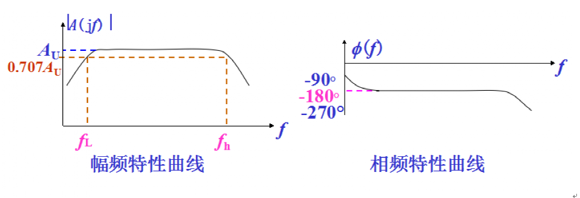

<center>图-1 频率响应</center>

​		音频设备的频率响应特性直接影响音色、音场等听觉效果。如果频率响应特性不平坦，有某段频率下陷的地方，则这一频段就会听不太清楚，而突出的频段则又会把较弱的频段遮盖掉，如图2所示。为了获取更好的听觉效果，需要改善音频设备的频响特性，进行频率响应补偿。图示均衡器使用模拟信号处理方法，对预先设置的 8 或 10 个频点进行提升或衰减，以获得所需的平坦频响。
​		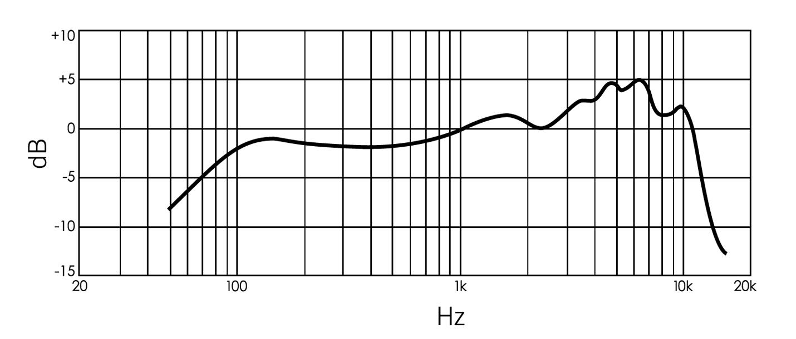

<center>图-2 频率响应曲线图</center>

### 模拟与数字信号

​		我们本身生活在一个模拟量的世界里，所谓模拟量，即连续变化量，屋里的温度是连续变化的，时间是连续变化的，诸如此类。而计算机是数字系统，他不能处理模拟量，而只能处理离散量，这意味着我们要把连续的模拟量进行采样，得到一系列离散的数字量。模拟量和数字量可以相互转换，模/数转换（A/D）和数/模转换（D/A） 。A/D转换通常使用`PCM`（脉冲编码调制）技术来实现，未经过数据压缩，直接量化进行传输则被称为`PCM`（脉冲编码调制）。A/D转换过程包括三个阶段，即取样、量化、编码。模数转换是将模拟信号转换成数字信号的系统，是一个滤波、采样保持和编码的过程。

​		采样是指将时间轴上连续的信号每隔一定的时间间隔抽取出一个信号的幅度样本，把连续的模拟量用一个个离散的点来表示，称为时间上离散的脉冲序列。每秒钟采样的次数称为采样频率，用`ƒs`表示；样本之间的时间间隔称为取样周期，用T表示，`T=1/ƒs`。采样频率为`44.1kHz`，表示每秒钟采样44100次，如图3所示。常用的采样频率有`8kHz、22.05kHz、44.1kHz、48kHz`等。


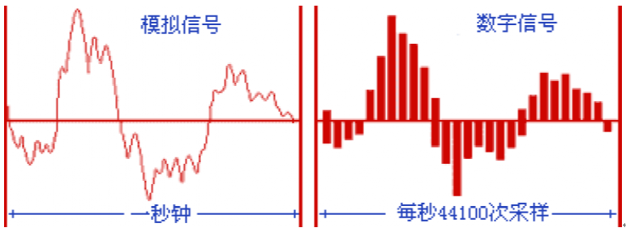


<center>图-3 数字信号和模拟信号</center>

​		量化就是把采集到的数值送到量化器（A/D转换器）编码成数字，每个数字代表一次采样所获得的声音信号的瞬间值。量化时，把整个幅度划分为几个量化级（量化数据位数），把落入同一级的样本值归为一类，并给定一个量化值，如图4所示。量化级数越多，量化误差就越小，声音质量就越好。

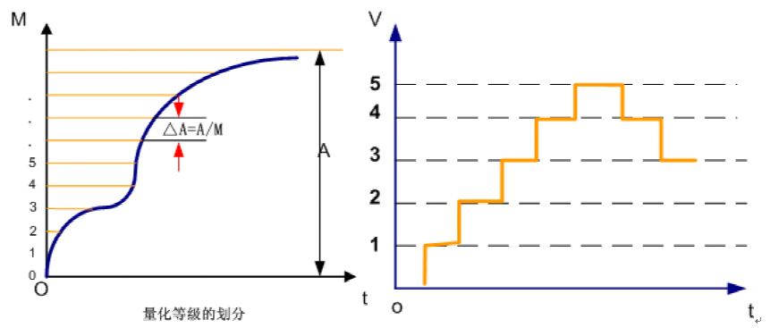

<center>图-4 量化等级</center>

​		量化级对应的二进制位数称为量化位数，量化位数是每个采样点能够表示的数据范围，有时也称采样位数，量化位数（大小）决定了模拟信号数字化以后声音的动态范围。量化级是描述声音波形的数据是多少位的二进制数据，通常用bit做单位，如`16bit、24bit。16bit`量化级记录声音的数据是用16位的二进制数，因此，量化级也是数字声音质量的重要指标。

​		编码是指采样、量化后的信号还不是数字信号，需要按一定的格式将离散的数字信号记录下来，并在数据的前、后加上同步、纠错等控制信号，再把它转换成数字编码脉冲，这一过程称为编码。编码有一定格式标准，最简单的编码方式是二进制编码。用这样方式组成的脉冲串的频率等于采样频率与量化比特数的积，称为所传输数字信号的数码率（音频：数据率、视频：码率）。显然，采样频率越高，量化比特数越大，数码率就越高，所需要的传输带宽就越宽。计算公式如下：

<center>数码率（bps）=采样频率（Hz）×量化位数（bit）×声道数（bit/s）</center>


​		自然界的信号都不是很干净的，都会有噪声。信号和噪声混叠在一起的，图5是一个更接近于真实的模拟信号强度随时间变化的数据集，图6是真实信号采样图。

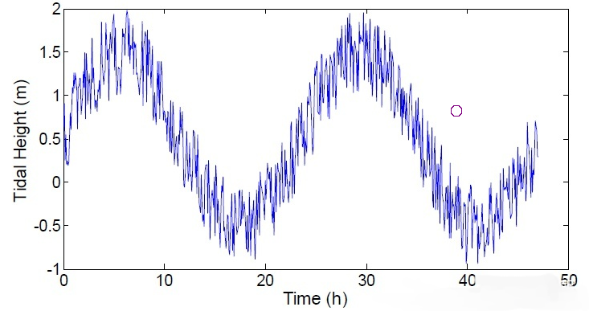

<center>图-5 模拟信号源</center>

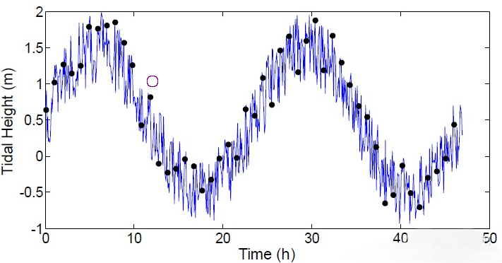

<center>图-6 真实信号采样</center>


​		用一条线把采样点连接起来，采集的到的数字波形可以看出明显的上下振动。由于高频噪声和原来的低频真实信号相叠加，最后采集出来的数据和原来的数据相比不一致，如图7所示。这是因为采样的频率远低于噪声信号的频率，发生了信号和噪声混叠在一起。

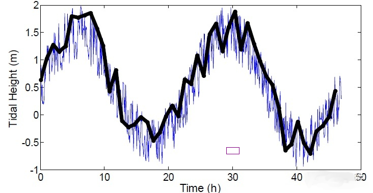

<center>图-7 信号和噪声混叠</center>

​		混叠通常是有害但又不可能100%避免，由奈奎斯特定理可知想要完整采集某个频率的信号，那么你至少要用2倍于该信号的最高频率的采样率来采集，否则混叠就会发生。除了提高采样率，另外一种避免混叠的方法是使用抗混叠滤波器. 通常在数字化之前使用一个低通滤波器把噪声滤掉即可。例如采样之前安装一个低通滤波器，截止频率为`10Hz` 那么你只需要一个`20Hz`的采样率就可以把你感兴趣的信号采集进来。高频噪声在采样之前就被模拟低通滤波器干掉了。当然，如果你采样频率够高，那么采样进来后才进行数字低通滤波也可以进行噪声过滤，而且绝大多数应用就是用的这种方法。

### `FFT` 傅里叶变换

​	傅里叶变换是指任何连续周期信号可以由一组适当的正弦曲线组合而成，换言之，满足一定条件的连续函数（周期函数）都可以表示成一系列三角函数（正弦和/或余弦函数）或者它们的积分的线性组合形式，这个转换就称为傅里叶转换。离散傅里叶变换其实可以看作是“离散时间傅里叶变换”（`DTFT`）的一个特例，离散时间傅里叶变换在时域是离散的，但是在频域是连续的，而离散傅里叶变换则在时域和频域都以离散的形式呈现，因此，离散傅里叶变换更适用于所有使用计算机处理数据的场合。

​	离散傅里叶变换的原理，首先要从连续傅里叶变换开始。因为工程中用的最广泛的是非周期信号，所以我们只关注非周期信号的处理方式。非周期信号傅里叶变换的基本思想就是：把非周期信号当成一个周期无限大的周期信号，然后研究这个无限大周期信号的傅里叶转换的极限特征。换句话说，就是把你要处理的非周期信号看作是一个只有一个周期的周期信号，所有的数据是周期性的，只不过只有一个周期而已。

​	下面使用`MATLAB`函数生成正弦信号加上白噪声的叠加信号，绘制时域数据窗口显示，如图9所示。

```matlab
%指定信号的参数，采样频率为 1 kHz，信号持续时间为 1.5 秒。
Fs = 1000;            % Sampling frequency                    
T = 1/Fs;             % Sampling period       
L = 1500;             % Length of signal
t = (0:L-1)*T;        % Time vector

%构造一个信号，其中包含幅值为 0.7 的 50 Hz 正弦量和幅值为 1 的 120 Hz 正弦量。
S = 0.7*sin(2*pi*50*t) + sin(2*pi*120*t);

%用均值为零、方差为4的白噪声扰乱该信号。
X = S + 2*randn(size(t));

%在时域中绘制含噪信号。通过查看信号 X(t) 很难确定频率分量。
subplot(2,1,1) %1st subplot
plot(1000*t(1:50),S(1:50));
title('Raw Data')
ylabel('X(t)')

subplot(2,1,2) %2nd subplot
plot(1000*t(1:50),X(1:50)); 
title('Signal Corrupted with Zero-Mean Random Noise');
xlabel('t (milliseconds)')
ylabel('X(t)')
```


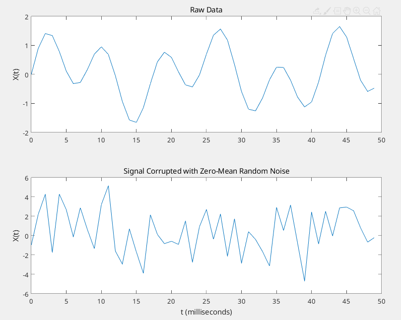

<center>图-9 零均值随机噪声破坏信号</center>

​	下面使用`MATLAB`的`fft`函数进行快速傅里叶变换，绘制频域数据窗口显示，如图10所示。

```matlab
%计算原始信号的傅里叶变换。
Y = fft(S);
P2 = abs(Y/L);
P1 = P2(1:L/2+1);
P1(2:end-1) = 2*P1(2:end-1);
f = Fs*(0:(L/2))/L;
subplot(2,1,1) %1st subplot
plot(f,P1) 
title('Single-Sided Amplitude Spectrum of S(t)')
xlabel('f (Hz)')
ylabel('|P1(f)|')

%计算混叠信号的傅里叶变换。
Y = fft(X);

%计算双侧频谱 P2。然后基于 P2 和偶数信号长度 L 计算单侧频谱 P1。
P2 = abs(Y/L);
P1 = P2(1:L/2+1);
P1(2:end-1) = 2*P1(2:end-1);

%定义频域 f 并绘制单侧幅值频谱 P1。与预期相符，由于增加了噪声，幅值并不精确等于 0.7 和 1。
%一般情况下，较长的信号会产生更好的频率近似值。
f = Fs*(0:(L/2))/L;
subplot(2,1,2) %2st subplot
plot(f,P1) 
title('Single-Sided Amplitude Spectrum of X(t)')
xlabel('f (Hz)')
ylabel('|P1(f)|')
```


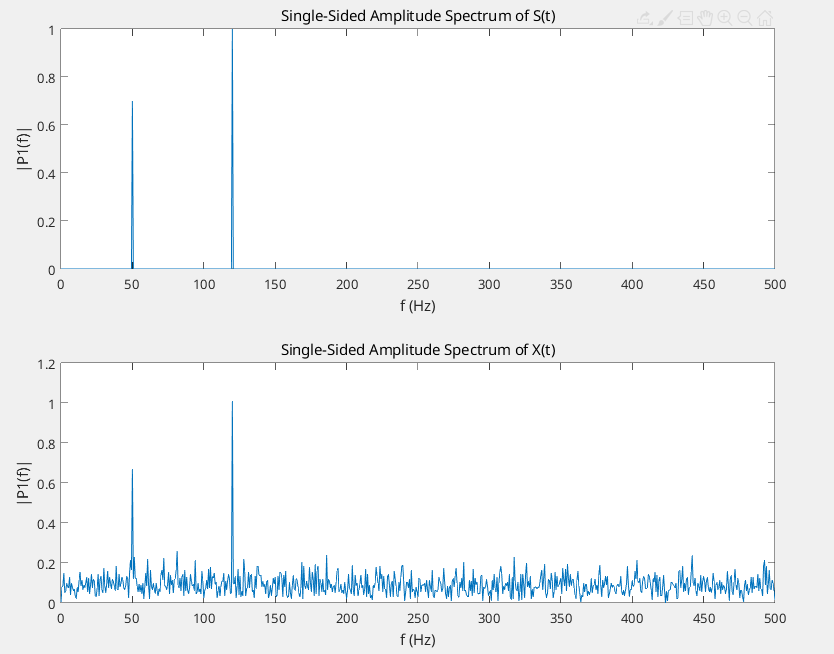

<center>图-10 单端振幅谱</center>


### 数字滤波器

​		滤波是信号处理中的一种基本而重要的技术，利用滤波技术可以在形形色色的信号中提取所需的信号，抑制不需要的干扰信号。按处理信号不同，滤波器可分为模拟滤波器与数字滤波器两大类。模拟滤波器是用来处理模拟信号或连续时间信号，数字滤波器是用来处理离散的数字信号。与模拟滤波器相比，数字滤波器具有诸多优点：可以用软件编程；稳定性高，可预测；不会因温度、湿度的影响产生误差，不需要高精度元件；很高的性能价格比。

　　滤波器是频率选择电路，只允许输入信号中的一定频率成分通过，与模拟滤波器相同，按通带来划分可将数字滤波器分为4种类型：

（1）低通滤波器（`Lowpass filter`） ：通过低频，滤除高频。
（2）高通滤波器（`Highpass filter`）：通过高频，滤除低频。
（3）带通滤波器（`Bandpass filter`）：通过固定范围的频率。
（4）带阻滤波器（`Bandstop filter`）：滤除固定范围的频率。

以上 4 种滤波器的理想频率响应，如图11所示。


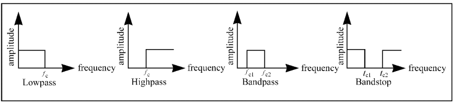

<center>图-11 数字滤波器类型</center>

​		滤波器允许通过的频率范围为通频带，理想滤波器通频带的增益为1，所以信号的幅值不变。截止频带是滤波器不允许通过的频率范围。理论上滤波器在通带应有单位增益(0 dB)，在阻带有0增益(-∞ dB)，然而在实际中通阻带之间有一个过渡范围，如下图所示。在这一范围，增益在0~1之间。在应用中，允许增益在单位增益上下轻微变化，即允许有通带纹波，如图12所示。这一点也是实际滤波器与理想滤波器的区别。阻带衰减在实际中不是无限的，通带纹波与阻带衰减可表示为：

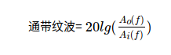

其中`A0(f)、Ai(f)`分别是一定频率f下的输出和输入振幅，通带波纹的单位为分贝(dB)。


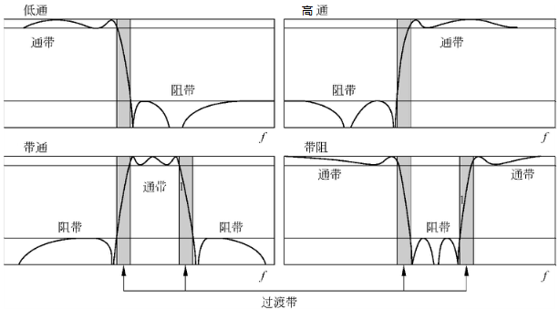

<center>图-12 数字滤波通带纹波</center>

​		例如对于`-0.02dB`的波纹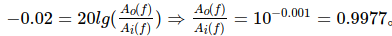这表明，输出和输入的幅值之比近似为1。当阻带有`-60dB`的衰减，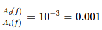，表明输出的幅度是输入的1/1000，如图13所示。

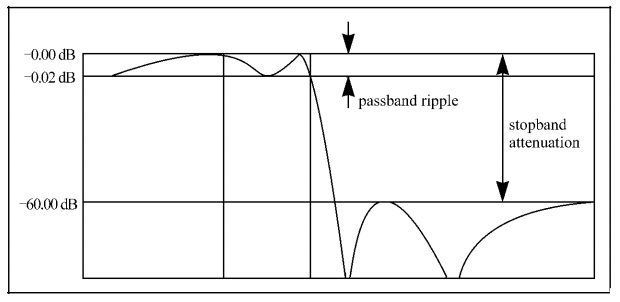

<center>图-13 数字滤波增益</center>

### `FIR(有限冲击响应滤波器)`

​		FIR(Finite Impulse Response)滤波器是指有限长单位冲激响应滤波器，又称为非递归型滤波器，是数字信号处理系统中最基本的元件，它可以在保证任意幅频特性的同时具有严格的线性相频特性，同时其单位抽样响应是有限长的，因而滤波器是稳定的系统。滑动平均滤波器就是FIR滤波器的一种。在一些应用中，有一个窗口，每一次新的数据进来都在窗口进行一次平局然后输出，如图14所示。


<center>图-14 3点滑动平均滤波器</center>

​		在这个滤波器中，可以看到每次把前三个数据进行平均(分别乘以0.33333)然后输出。 这三个系数的不同组合(0.3333, 0.333, 0.3333)就组成了各种FIR滤波器。这些系数叫做滤波系数。 在`matlab`中，他们叫做 b，滤波系数。

​	下面是一个移动平均滤波器的例子，使用plot函数绘制图形显示，如图15所示。

```matlab
npts=1000;
b=[.2 .2 .2 .2 .2]; % create filter coefficients for 5- point moving average

x=(rand(npts,1)*2)-1; % raw data from -1 to +1
filtered_data=filter(b,1,x); % filter using 'b' coefficients

subplot(2,2,1); % 1st subplot
plot(x); % plot raw data
title('Raw Data');
subplot(2,2,3); % 2nd subplot
plot(filtered_data); %plot filtered data
title('Filtered Data');
xlabel('Time')

% Perform FFT on original and filtered signal
fftpts=npts; % number points in FFT
hpts=fftpts/2; % half number of FFT points
x_fft=abs(fft(x))/hpts; %scaled FFT of original signal
filtered_fft=abs(fft(filtered_data))/hpts; %scaled FFT of filtered signal

subplot(2,2,2) %1st subplot
plot(x_fft(1:hpts)); %plot first half of data points
title('Raw Data');
subplot(2,2,4) %2nd subplot
plot(filtered_fft(1:hpts));%plot first half data points
title('Filtered Data');
xlabel('Frequency');
```


<center>图-15 FIR低通滤波器</center>

​	滑动动平均滤波器 一开始滤波的时候没有之前的数据做平均，  `matlab`的 filter函数是这样计算的

<center>filtered_data(2) = x(1)*0.2 + x(2)*0.2</center>

​	5点滑动滤波的计算公式是：

<center>filtered_data(n) = b(1)*x(n) + b(2)*x(n-1) + b(3)*x(n-2) + b(4)*x(n-3) + b(5)*x(n-4)</center>


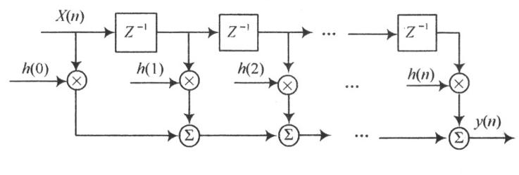

<center>图-16 FIR滤波器基本结构</center>

​	如果滤波器的阶数很大(N) 那么滤波后的数据要比原始信号"迟缓" 很多。这叫做相位延时可以看出，5点滑动平均滤波器会使高频分量衰减。这是一种低通滤波器, 通低频，阻高频。FIR滤波器基本结构，如图16所示。


### `IIR(无限冲击响应滤波器)`

​		`IIR`数字滤波器采用递归型结构，即结构上带有反馈环路。`IIR`和`FIR`类似，不过进入了反馈机制。即下一次的滤波输出不仅仅和上几次的输入信号有关，还和上几次的输出信号有关。`IIR`比`FIR`"效率"更高，通常用更少的系数就可以达到很好的滤波结果，但是`IIR`也有缺点，由于引入了反馈机制，一些特定的系数组成的`IIR`滤波器可能不稳定，造成输出结果崩溃。。根据`IIR`滤波器的不同系数 有很多经典的`IIR`滤波器，例如`Butterworth`, `Chebyshew`, Bessel等。

​	下面例子使用巴特沃斯滤波器（`butterworth`），使用plot函数绘制图形显示，如图17所示。

```matlab
% Butterworth IIR Filter
%先产生一个采样频率1000Hz， 2000个采样点的随机信号，然后用butter滤一波
srate=1000; % sample rate
npts=2000; %npts in signal
Nyquist=srate/2; %Nyquist frequency
lpf=300; %low-pass frequency
order=5; %filter order
t=[0:npts-1]/srate; %time scale for plot
x=(rand(npts,1)*2)-1; % raw data from -1 to +1

[b,a]=butter(order,lpf/Nyquist); %create filter coefficients

filtered_data=filter(b,a,x); % filter using 'b' and 'a' coefficients

% Calculate FFT
fftpts=npts; % number points in FFT
hpts=fftpts/2; % half number of FFT points
binwidth=srate/fftpts;
f=[0:binwidth:srate-binwidth];
x_fft=abs(fft(x))/hpts; %scaled FFT of original signal
filtered_fft=abs(fft(filtered_data))/hpts; %scaled FFT of filtered signal

subplot(2,2,1)
plot(t,x);
title('Raw Time Series');
subplot(2,2,3)
plot(t,filtered_data);
title('Filtered Time Series');
xlabel('Time (s)');
subplot(2,2,2)
plot(f(1:hpts),x_fft(1:hpts));
title('Raw FFT');
subplot(2,2,4)
plot(f(1:hpts),filtered_fft(1:hpts));
title('Filtered FFT');
xlabel('Frequency (Hz)');
```

​		butter 函数是`matlab`内置函数，输入截止频率和阶数，返回滤波器系数，b, a。 b 就跟FIR 一样的b(前馈系数)， a指的是后馈系数。


<center>图-17 IIR低通滤波器</center>


​		我们可以看出同样是5阶滤波，`IIR `滤波类型的巴特沃斯滤波器的滤波效果单从幅频响应来说 比滑动平均滤波器好了不少。`IIR `滤波器原理是输入信号为x(m). 对应的乘以每一个b系数。 在5点滑动平均滤波器的例子中，这个b 就是 0.2,0.2,0.2,0.2,0.2. 输出为y(m). 这样每一个x(m)乘上对应的系数然后再加在一起 组成了 `y.IIR `滤波器引入了'a' 系数反馈环节，如图18所示。 每一次滤波，上一次的输出也要程序对应的系数a 然后减到本次输出中，计算公式如下：

<center>y(n)=b(1)*x(n)+b(2)*x(n-1)+ ... + b(n)*x(n) - a(2)y(n-1) - a(3)*y(n-2)...</center>

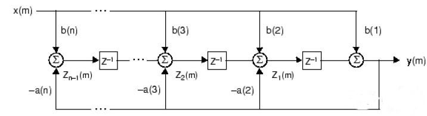

<center>图-18 IIR滤波器基本结构</center>

​		数字滤波器设计是一个复杂的数学运算，可以使用`Matlab filterDesigner` 工具生成FIR滤波器函数，在`matlab`命令窗口输入：`filterDesigner`命令，即可打开`filterDesigner`设计工具。下图设计的是采样频率`100Hz`，截止频率`10Hz`的7阶FIR低通数字滤波器，如图19所示。

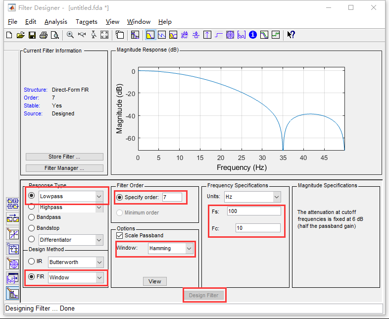

<center>图-19 Matlab filterDesigner</center>

完成滤波器设计后，您可以通过点击工具栏上的任意按钮，在显示窗口中查看以下滤波器分析：       

​													

​		按从左到右的顺序，按钮排列如下，幅值响应、相位响应、幅值响应和相位响应、群延迟响应、相位延迟响应、脉冲响应、阶跃响应、极点-零点图、滤波器系数、滤波器信息。

